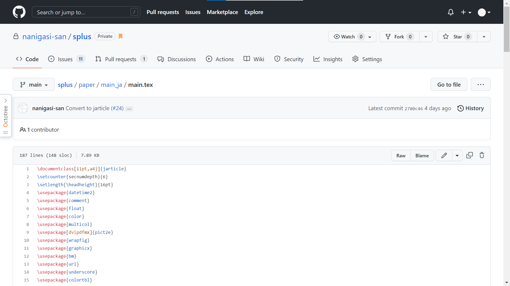
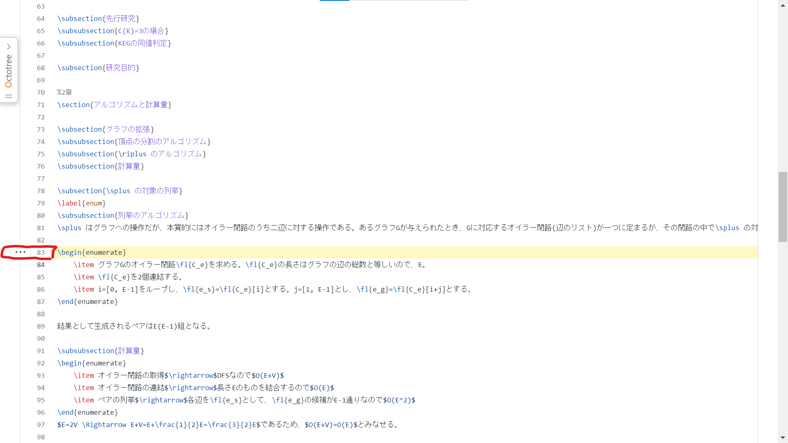
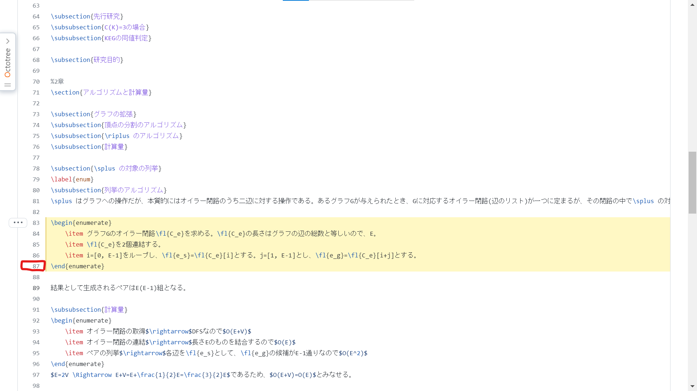
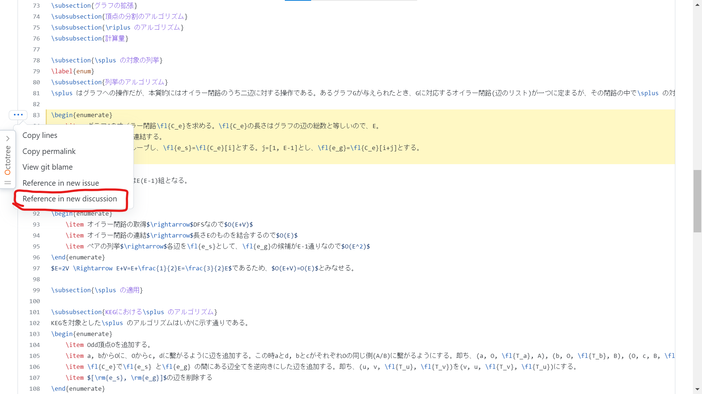
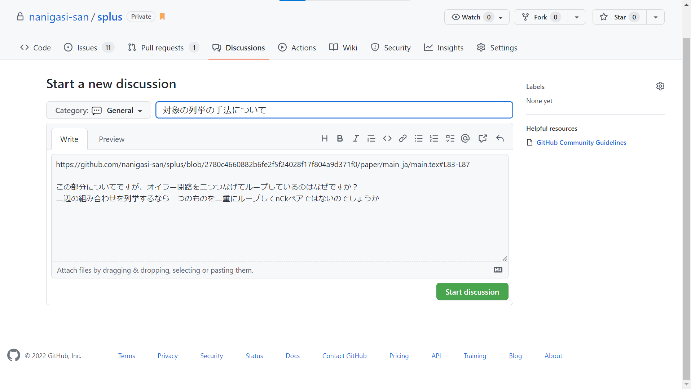
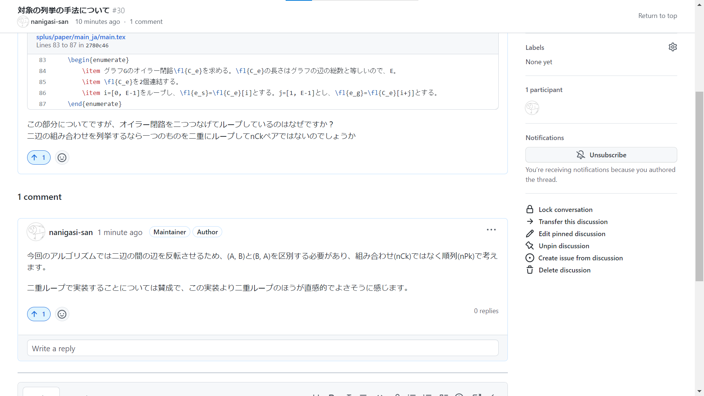
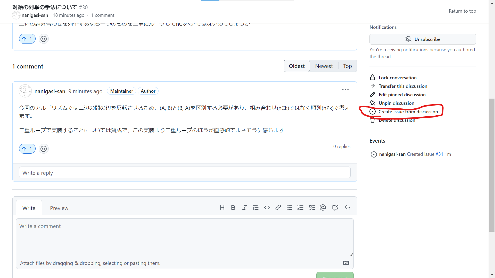

# これはなに
# コードや理論の内容についての質問や議論(Discussions)
表面的な表現や記述ではなく、内容に関する議論すべき点や不足が感じられる点については、Discussionsを用いて質問をしてください。

口頭での議論で解決したとしても、内容を解決後に参照できるように問題提起をされていると助かります(内容については後で追加すればよいため)。

これは以下の手順で行うことを推奨します。
1. ソースコードを閲覧する
2. 議論したい部分を選択する
3. Discussionsで質問を作成する

## 1. ソースコードを閲覧する
ブラウザでリポジトリを開いてファイルを閲覧します。例として、日本語論文のソースファイルである[main.tex](../papers/../paper/main_ja/main.tex)を開いています。

## 2. 議論したい部分を選択する
行番号をクリックするとその行が選択できます。

次に、**shiftを押しながら**下の行をクリックすることで、先に選んだ行からその行までの範囲を選択できます。

## 3. Discussionsで質問を作成する
選択した範囲の横にある三点部分をクリックするとメニューが開くので、`Reference in new discusion`を選択します。

すると議論の作成画面に行くので、
+ カテゴリー
+ タイトル
+ 内容

を書いていきます。カテゴリーはGeneralで大丈夫です。
書き終わったら`Start discussion`を押すと完了です。

## その後
下に続く形で議論が展開されていきます。

例えば今回の場合では、本当に改善するべき点があったため実際に変更したほうがいいという結論が出ました。

この場合は右下の`Create Issue fro discussion`からissueを作成します。

# 論文の表現などの修正の提案(Issues/Pull requests)
論文内の表現などについて、修正するべき点がはっきりしている場合、実際にソースコードを変更して修正の提案をすることができます。
後で書く。