# これはなに
# コードや理論の内容についての質問や議論(Discussions)
表面的な表現や記述ではなく、内容に関する議論すべき点や不足が感じられる点については、Discussionsを用いて質問をしてください。

口頭での議論で解決したとしても、内容を解決後に参照できるように問題提起をされていると助かります(内容については後で追加すればよいため)。

これは以下の手順で行うことを推奨します。
1. ソースコードを閲覧する
2. 議論したい部分を選択する
3. Discussionsで質問を作成する

## 1. ソースコードを閲覧する
ブラウザでリポジトリを開いてファイルを閲覧します。例として、日本語論文のソースファイルである[main.tex](../papers/../paper/main_ja/main.tex)を開いています。


## 2. 議論したい部分を選択する
行番号をクリックするとその行が選択できます。


次に、**shiftを押しながら**下の行をクリックすることで、先に選んだ行からその行までの範囲を選択できます。


## 3. Discussionsで質問を作成する
選択した範囲の横にある三点部分をクリックするとメニューが開くので、`Reference in new discusion`を選択します。


すると議論の作成画面に行くので、
+ カテゴリー
+ タイトル
+ 内容

を書いていきます。カテゴリーはGeneralで大丈夫です。
書き終わったら`Start discussion`を押すと完了です。


## その後
下に続く形で議論が展開されていきます。

例えば今回の場合では、本当に改善するべき点があったため実際に変更したほうがいいという結論が出ました。


この場合は右下の`Create Issue fro discussion`からissueを作成します。


# 論文の表現などの修正の提案(Issues/Pull requests)
論文内の表現などについて、修正するべき点がはっきりしている場合、実際にソースコードを変更して修正の提案(PR: Pull request)をすることができます。PRを送るときは
+ issueと紐づいたPRを作成する(事前に提示されている課題に対してのPR)
+ 自分でブランチを切ってPRを作成する(issueにするほどでない細かい改修のPR)

の二通りがありますが、先生からの修正は後者が多いのでそれに絞って解説します。


これは以下の手順で行います。
1. mainブランチを最新バージョンと同期する
2. ブランチを切る
3. ソースコードを編集する
4. pushする
5. PRを開く
6. レビュー/mergeを待つ

ここでは、作業の都合上別のリポジトリ(C++による画像操作コード)で行っていますが、方法は一緒です。

## 1. mainブランチを最新バージョンと同期する
まずはGitHub Desktopを開き、`main`ブランチにいることを確認してから`Fetch origin`をします。これで`Pull 2`などと出てきたらそれをクリックし、最新のバージョンと同期します。

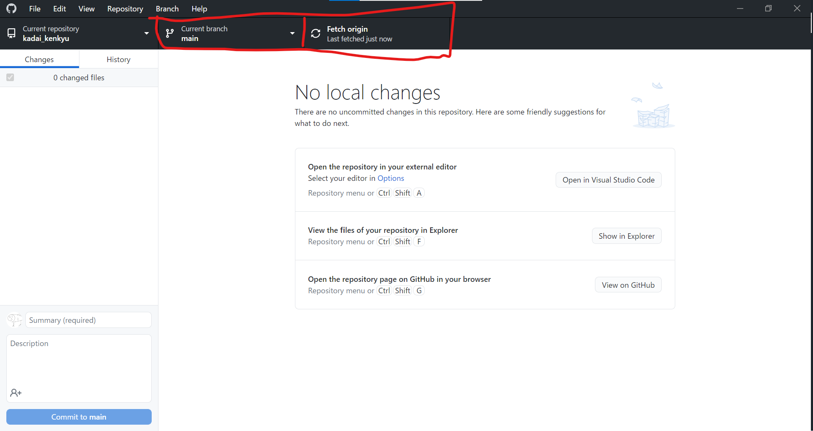

## 2. ブランチを切る
ブランチタブをクリックし、`New branch`をクリックし新しいブランチ(分岐)を作成します。

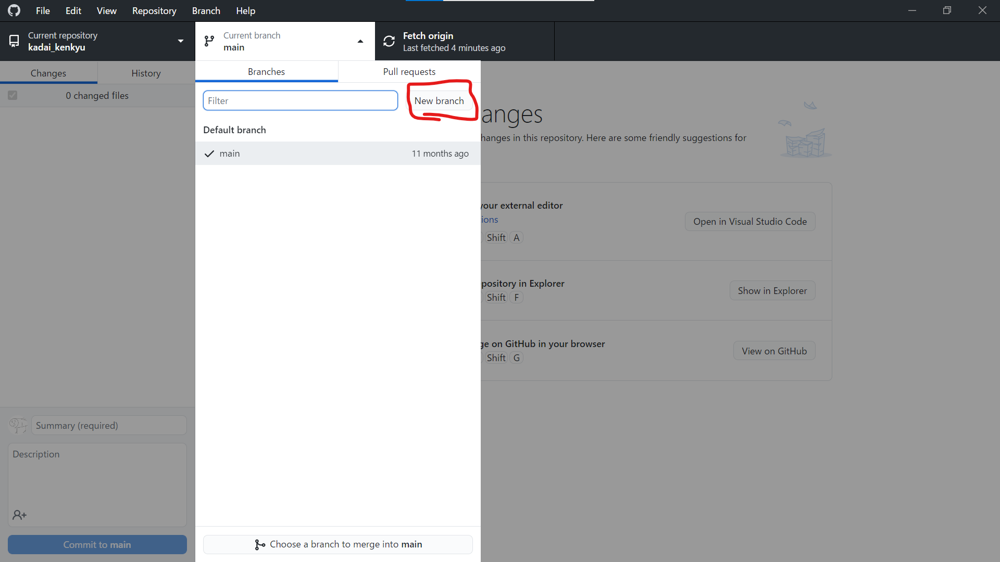

ここでは論文に対して小さな変更を加える前提で`little_change_of_paper`としました。このブランチ名は、二回同じ名前を使わないほうが良いため、ユニークな命名が不可能な場合は`change_1031`のように日付や番号を入れることで一意性を保ってください。

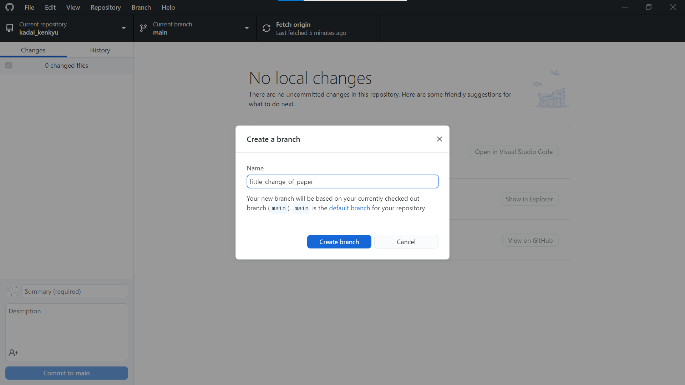

新規作成したブランチをWeb上に同期したいので`Publish branch`を押します。

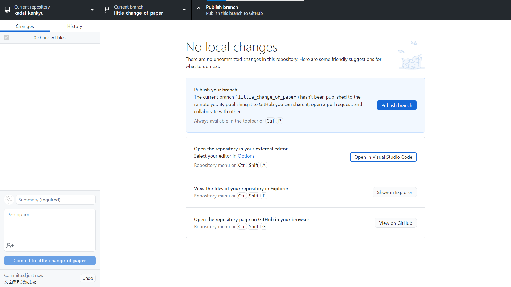

これで準備は完了しました。ここからは実際にソースを編集していきたいので、`Open in Visual Studio Code`をクリックしてVSCodeを起動してください。

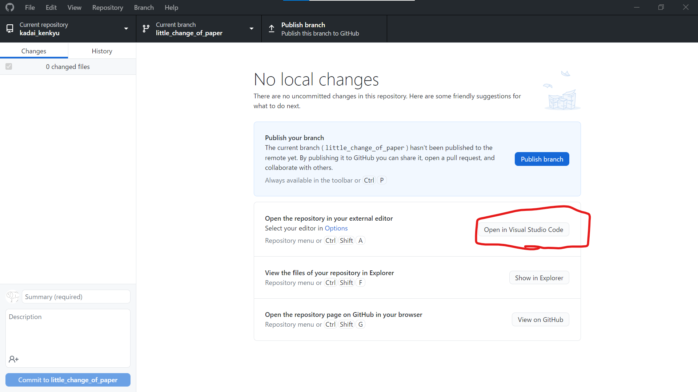

## 3. ソースコードを編集する
カラーテーマなどが異なる場合はありますが、右下に作成したブランチ名が出ていれば問題ありません。

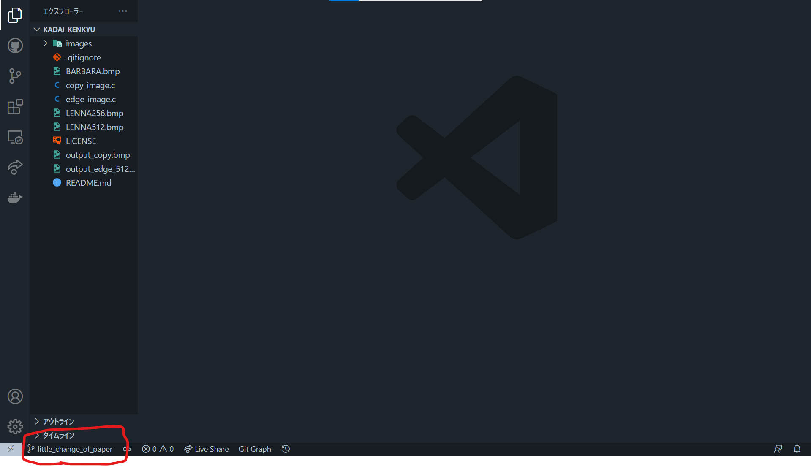

ここでは下線部の文面を更新しました。ファイルの変更を保存すると左にある枝の形をしたバーに通知バッジがつくはずです(ここでは1ファイル変更したので①がついています。)

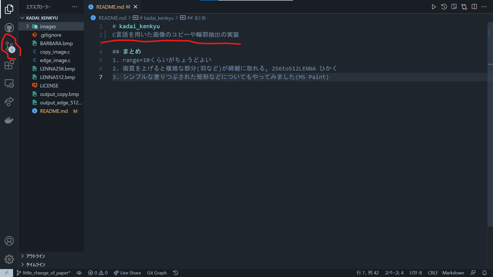

## 4. commit/pushする
そのバーをクリックするとこのような画面に遷移するため、コミットボタンの下にあるプラスを押すと、すべてのファイルがステージングされます。その後はその上にある`メッセージ`ボックスにどんな変更をしたかを簡潔に書いてコミットボタンを押します。変更した目的などについては後述するPRで書くため、コミットメッセージは簡潔でかまいません。例として、
```
論文の誤字を修正
```
```
結び目に関して使う用語を統一した
```
などで十分です。

コミットは何回でもできる上修正も容易(別のコミットで上書きできる)なので、作業が一段落つくたびにコミットしてかまいません。

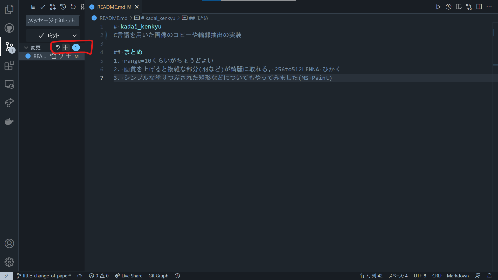

コミット後に`変更を同期する`が出てきた場合、クリックしてください。Web上の情報が更新されます。

## 5. PRを開く
修正案についてある程度まとまったら。それをメインブランチに反映するための申請(PR)を送ります。
この粒度については制限がありませんが、変更の累計行数が1~50行以内だとチェックがしやすくありがたいです。

GitHub Desktopを開き、`Create Pul Request`をクリックします。この時、リポジトリやブランチがあっているかを確かめてください。

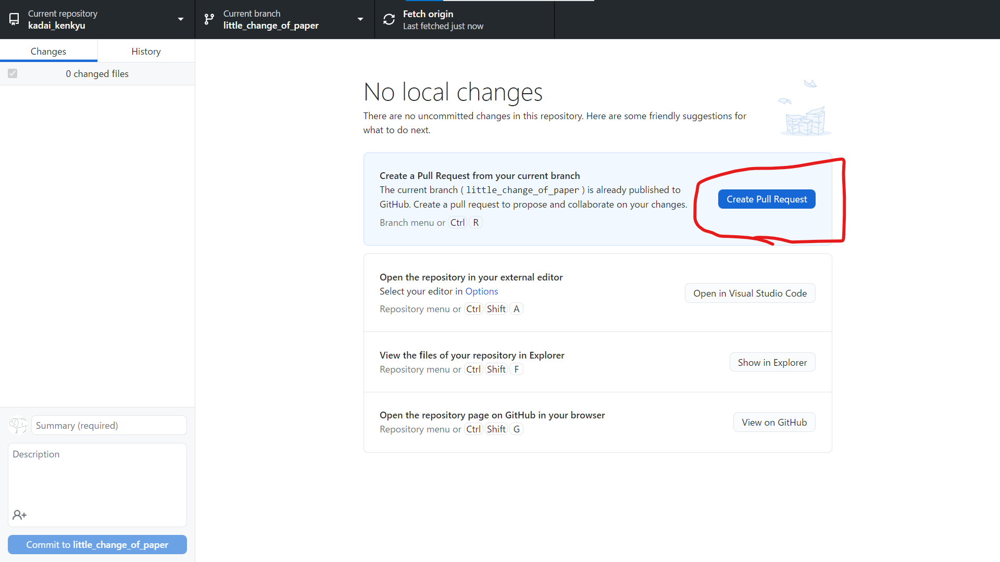

ブラウザが起動するはずです。出てきた画面を下にスクロールすると自分が変更の最終的な差分が表示されているはずなので、問題ないかをチェックしてください。見逃しやミスに気づいた場合、手順3, 4を繰り返してください。

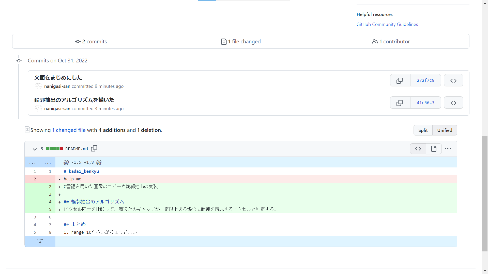

問題ない場合、PRメッセージを作成していきます。タイトルはブランチ名が入っていますが、日本語で適切なものに書き直してもかまいません。
+ タイトル(変更は任意)
+ PRメッセージ(全体的な変更の理由程度でかまいません。説明が必要と思われる箇所については細かく記していただいたほうが嬉しいです。)
+ `Reviewers`にnanigasi_san(あるいはリポジトリの主)を指定

ののちに`Create pull request`をクリックしてください。
## 6. レビュー/mergeを待つ
Reviewerに指定した人間が差分を読んで、`Approve(承認)`あるいは`Request Change(変更要求)`が返ってきます。今回はRequest Changeで「こうしたらさらにいいのでは？」という変更案が来たので、それをさらに反映し、内容を詰めていきます。これで内容が定まった場合、Approveが出ます。

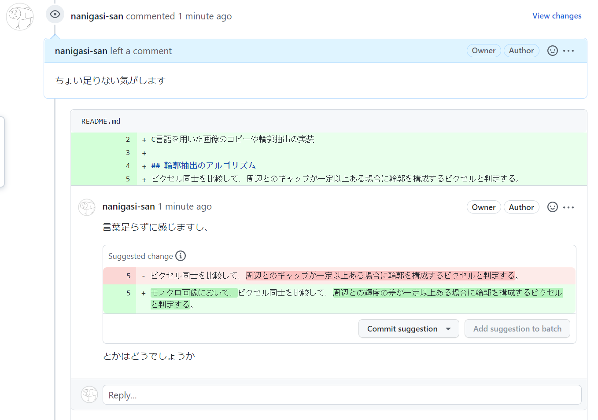

その後Reviewerによってmerge(mainブランチへの統合)が行われ、無事改善案が反映されました。

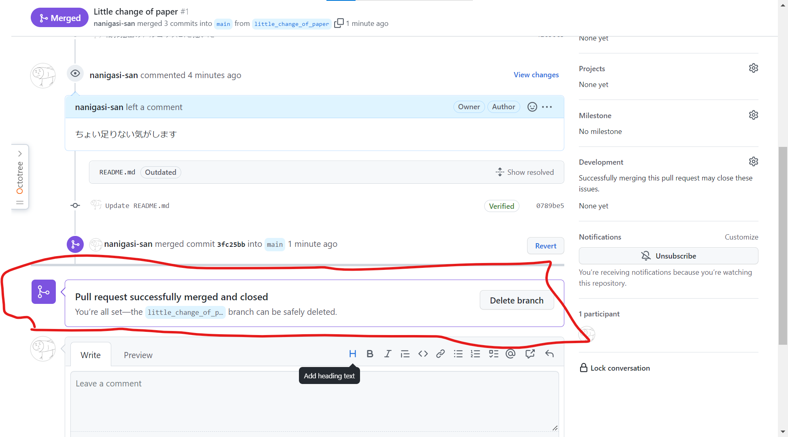

mainブランチのコミットログを見てみると、しっかり反映されていることがわかります。

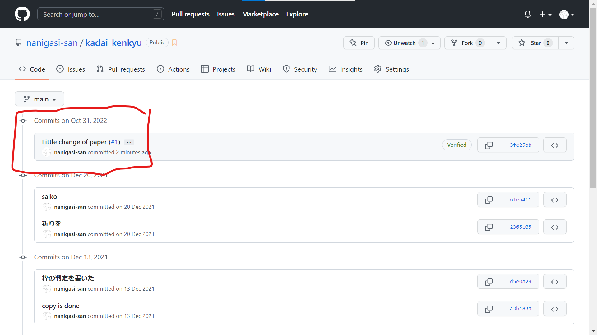